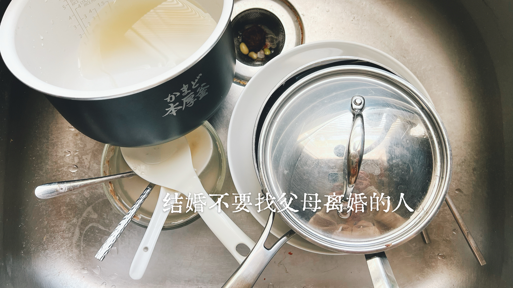

+++
date = '2026-07-27T14:58:11-07:00'
draft = false
title = '2026-07-26 「结婚不要找父母离过婚的人」'

categories = ['life']
summary = "受过伤，并不自动决定人以后会变成什么样。"

[thumbnail]
src = "20260726-banner.jpg"
alt = "Banner"
+++

受过伤，并不自动决定人以后会变成什么样。 —— by 我

今天和男友吵架，我邀请他一起思考：我们的父母在争吵之后，是如何和好的？
翻找我自己的童年记忆，我发现几乎想不起父母有过任何 explicitly 示好的语言或行动。
好像大家只是一直捂着不说，最后就会默认这件事情已经解决了。

哪怕日子已经过到彼此天怒人怨，我妈还是会坚持「不能离婚。」
因为「离婚会被人看不起。」
而且「对你也不好，你以后结婚，人家也会看不起你。」

无独有偶。
男友之前说到他妈妈的择儿媳观，也是：结婚要找父母没有离婚的女孩子，父母离过婚的人，多多少少都会有点问题。

此处，我的想法有二。

【 一 】

我更加庆幸自己在美国。

这里社会观念更加多元，人情世故也更松散，一个人的社会化成长路径也不再只有原生家庭塑形这一条。
这些都帮助了我在精神上完成了和原生家庭建立边界，意识到父母的人生是他们自己的课题，孩子不用管父母那一摊子烂事也是可以的。
也有机会观察到更多不同的人、善良乐观的人，也看到很多值得学习、值得模仿的好关系，让我不断去反思、去纠正原生家庭给我带来的固有意识和处理问题的行为模式。

如果是几年前，我大概会毫不犹豫加入「反迂腐」大军，痛批这种「哪怕里子已经过得稀烂，面子上还是要装得家和万事兴」的吃人活法。
但现在想想，我似乎可以理解（但不赞同）为什么这种刻板观念会在中国社会里依旧根深蒂固。

表面上它表达的是：原生家庭有缺陷的孩子，长大之后自己的婚姻也容易出问题。
但它背后真正默认的是另一套前提，是一套把人看得很扁、很狭隘的世界观：
原生家庭是一个人学习如何与人相处的唯一途径。
人没有重新学习、重新社会化、重新养育自己的能力。

再结合中国社会里普娃相对单一的成长路径、紧凑压抑的人情世故，以及人与人之间越来越稀薄的信任和善意。
生活其中仿佛一直被捆锁在地上。
在这样的环境下，原生家庭也许真的会成为很多普通人学习社会关系最重要，甚至近乎唯一的来源。

如果一个人出生在一个父母只会以固有思想和人生轨迹划下去的家庭，这辈子又始终没有遇见能够启发自己的人，社会环境也不断强化那些压抑、充满评判、充满羞辱的相处方式，那么，人是不是的确会更难改变？

【此处应有劝告诸君珍惜当下，努力重新养育自己，笑】

【 二 】

另一个让我想到的，是关于和男友的相处。

他曾说他的家人长期的挖苦让他养成了不自信的性格。
现在在我们的关系里他也经常用挖苦的方式和我说话。
当我告诉他这种话让我很不舒服时，他只打趣的说：「我继承了我妈的毒舌。」

仿佛一句「我只是开玩笑」，就足以把这件事轻轻放下。
却不去感同身受：听的人长期累积的不舒服，并不会因为一句「我开玩笑」就自动消失。

我一直试着用心理学的角度去理解这一连串的事。
我的猜测是：他小时候其实是排斥这种精神上的打压的。
但长期生活在这样的环境里，他慢慢把它 normalize 了。
后来，他开始模仿这种交流方式，把攻击和贬低的互动方式当作正常的互动。
久而久之，在和亲近的人相处时，他也会不自觉地用同样的方式说话。

当别人表达反感时，他想到的不是：「我让对方不舒服了，我要如何去改善这个问题？」
而是：「为什么别人不懂我？」
他不知道如何修复关系，也不知道如何缓和自己给别人带来的伤害。

受过伤，吃过苦，并不会自动决定一个人以后会变成什么样。
一个人中苦难里吸取了什么，决定是要沿老路走下去还是把自己拔出来，才会决定以后他变成什么样。
有人受过伤，所以以后在人际关系里格外小心，努力不把同样的伤害带给别人。
也有人受过伤，久而久之把伤害视为正常，觉得：我就是这样长大的。
于是伤害一代一代的重复下去。