+++
date = '2026-08-11T23:36:48-04:00'
draft = false
title = '20260802 「Google Vibe Coding 5-Day」 DAY1笔记'

categories = ['ai']
+++

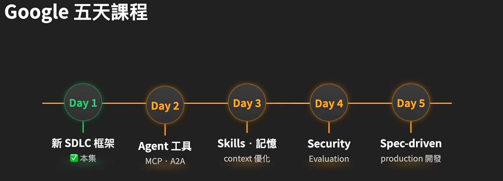

## SECTION 1. vibe coding 和 agentic engineering 的区别？

它们不是二选一，而是一条光谱的两端。

两者区别在于 ai 周围有多少的结构、验证、人类判断。

- intent的规格化程度： vibe = 随口的自然语言 ； AE 是正式的spec，architecture docs， memory files
- 验证的系统性和严谨性
- 遇到错误怎么处理？ 贴回去让ai修？还是人类只处理架构层级的问题，agent在人类定义好的边界里自我诊断？

「有没有验证」和「验证方式用了什么」是最大的分水岭，决定你做的东西是engineering还是slop。
- test = 只验证确定性的东西：这个输入就该给这个输出
- eval = 还要验证非确定性的东西： 这个输出背后走的路径trajectory对不对，工具选的对不对，产出有没有到品质标准

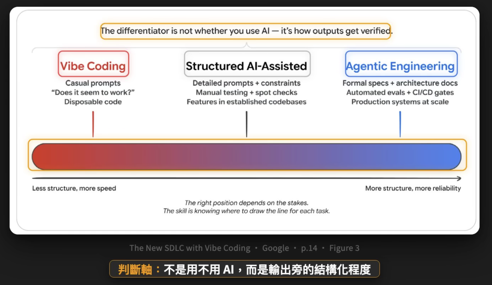
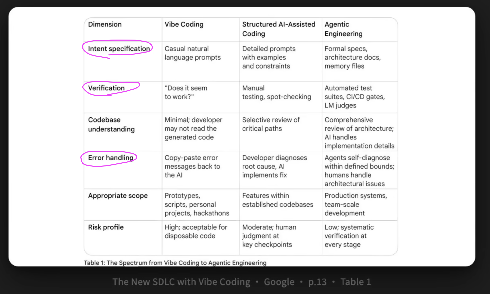

 
 

## Section 2. Context Engineering 是通往 agentic engineering 的桥（基本功）

把agent想成你的员工，context engineering就像你给他们的「员工入职简报」。

### 【6 种 context】
    1. instructions： 定义它的角色和边界
    2. knowledge： 赋予它什么样的domain knowledge
    3. memory：
    4. example：给它的行为示范
    5. tools： 定义它能呼叫的工具
    6. guardrails： 对他的硬性约束

---
### 【这6种context可以分成两类】 
- static context = 每次都需要预先载入的东西，比如 CLAUDE.md。好处是硬性可靠，坏处是很贵烧token
- dynamic context = 有需要的时候才载入的东西，比如 skills。好处是便宜+可扩展，坏处是存在「有时候该载入时候agent没去载入」的风险。

---
### 【决定哪些 context 作成静态/动态】
这本身就是一个关键的 architectural decision 架构层面的决策，需要人去深思熟虑和控制。
vibe人士只知道交给ai去决定。

---
### 【Skills 是目前最高级的管理 Dynamic context 的方式】
skills 是一种「prgressive disclosure 渐进式披露」。
先只给ai当前任务必需的信息，需要更多时再逐步加载，而不是一上来把所有资料全塞给它。
1. 复利效应：每天用。慢慢改，不要想着一步到位，要持续迭代。
2. agent 友好，人类可维护：不要写长篇skill，太长需要 break 成 sub-skills。

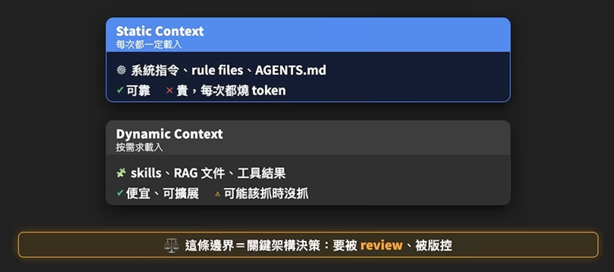
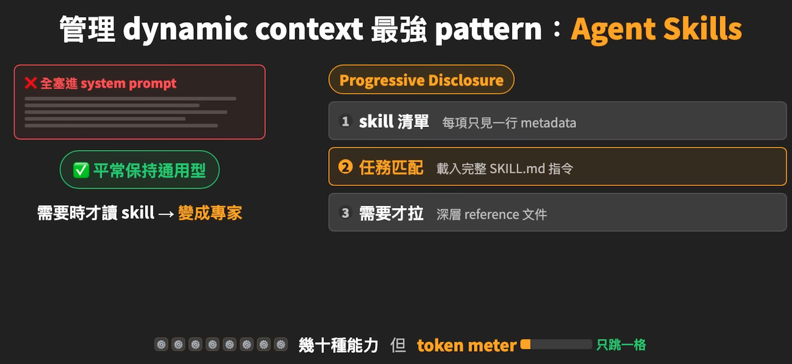

## Section 3. Harness engineering 是什么？ 

### 【软件开发流程 SDLC = software development life cycle】 
传统的软件开发流程：需求-设计-implement(写代码)-测试-部署-维护

AI 不均匀的压缩了这套开发流程，原来最费时的implement步骤现在最快，但是其他步骤还是人类的速度。

新流程里每个阶段的边界变模糊，迭代时间更短，前期 spec 的品质变成新的开发瓶颈。

【就是所谓的 never write your code before you find the pain point 】 

新流程里：

implement阶段更快：写代码变成了「review、引导、验证」

mentainence阶段更友好：ai让框架迁移、更新过时api、现代化测试更友好。比如：以前神人留下的legacy code没人敢动，现在ai可以读懂整个code base，在尊重已有框架的前提下做出优化。 

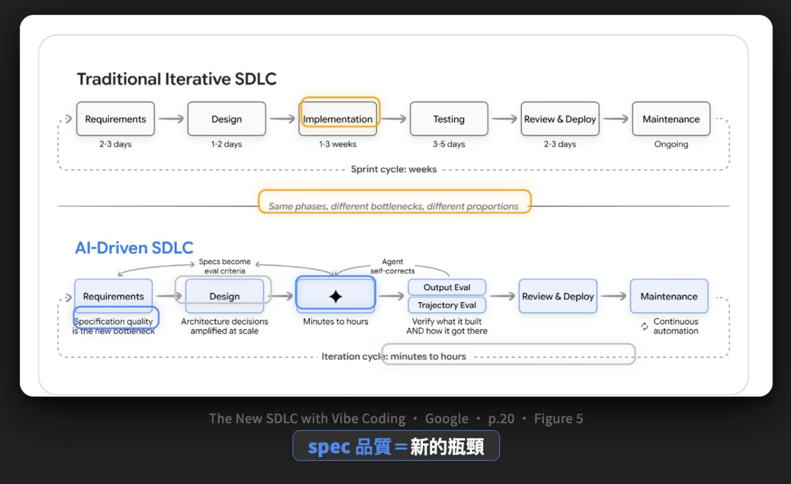
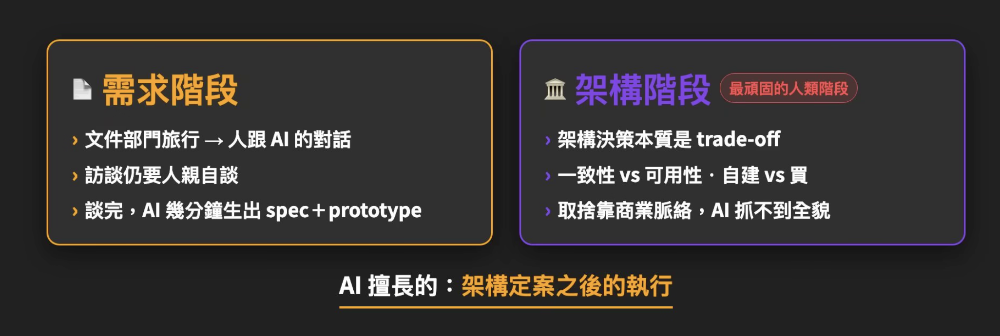

---
### 【a mental model called "factory model"】
谷歌提出了一个心智模型（我们人怎么思考自己与ai的角色定位）：把开发想成「开工厂」。

你是「工厂经理」，不亲手组装零件，只研究客户、设计生产线、把关品质。

ai 是「流水线上的工人/机器」。

你的「产品」以前是你逐个手搓hand-made，现在是你设计的流水线上跑出来的。
 
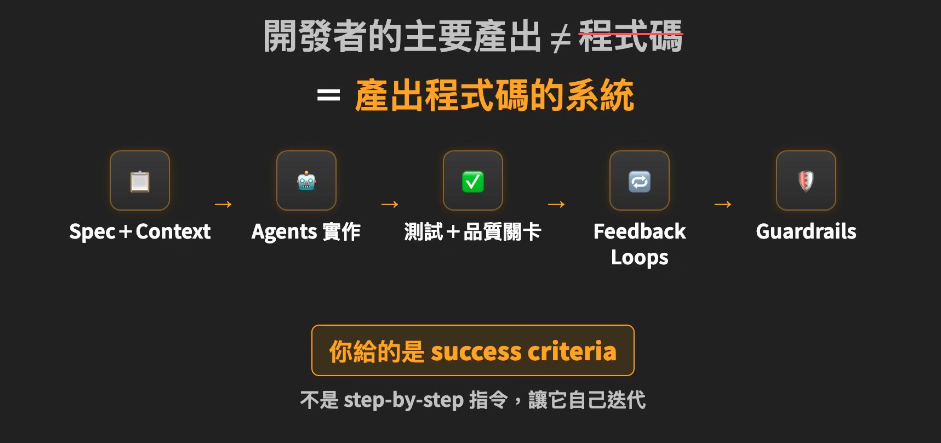

---
### 【Agent = model + harness】
比喻：你的业务表现 = 你的脑子 + 给你配套好的工作环境

同一颗大脑，换一套工作环境，表现天差地别。(think: nature vs. nurture)

大部分agent失败都是configuration失败。

同一个model下，agent有好有坏，差别在你花多少时间在投资建立自己团队的harness。

前面我们说context engineering就像「新员工入职简报」，那么harness就像「整个公司的运作体系」。

---
### 【出错后的5分钟习惯：把错误从成本变成资产】
agent出错 - 别修完bug就走 - 问自己：rules/workflows/skills哪里能改？- 把答案写回harness

---
### 【harness应该是你的地盘】
model是厂商在控制，你控制不了，harness是你唯一能控制、最值得投资的地方。

换一个model你也能复制你的工作流，不然你就只能依赖model厂商给你的东西。

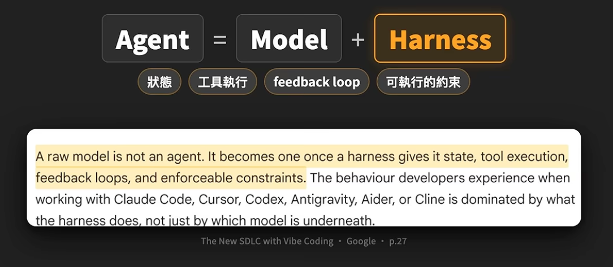

---
### 【harness 六大件】
1. instructions & rule files: agent是谁，应该在乎什么，绝对不能做什么
2. tools：它能呼叫什么tools、MCP servers、以及「什么时候该用哪一样工具」的说明
3. sandboxes：它操作范围的scope，比如：它写的代码能在哪里跑、它能读写哪些文件夹的东西 etc
4. orchestration logic：多个agent协作时的编排调度逻辑，「谁干什么、什么时候叫谁、干完交给谁」
5. guardrails & hook：「护栏」就是安全红线的硬性规定「什么绝对不能做」；「钩子」是自动触发机机制「当某个固定事情发生时，会自动执行的一系列预先规定好的检查动作」，用来放「agent不该忘、但是常常会忘记的事」（有点像外置memo？）
6. Obeservability: worklogs、traces、evals、成本监控 etc。没有这一层，你不知道agent是真的做得好、还是在偷偷浪费token乱做一通。

hook的例子：ai要git commit - 会触发hook - 系统自动运行检查/测试 - 检查通过了ai才可以顺利commit

---
### 【人在这套流程里的角色将会是？】
「conductor指挥家」和「orchestrator调度者」之间来回切换。

Think：在「严密监控 vs. 放牛吃草」两个状态中找到自己的balance。

「orchestrator调度者」要具备的4种技能：见下图。

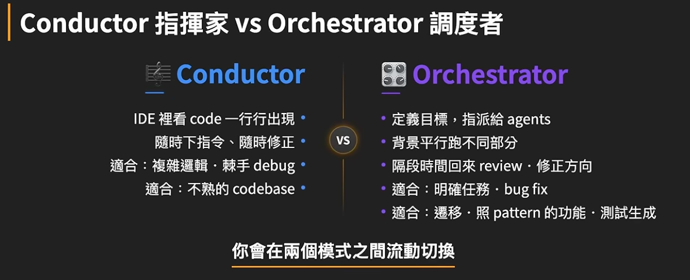
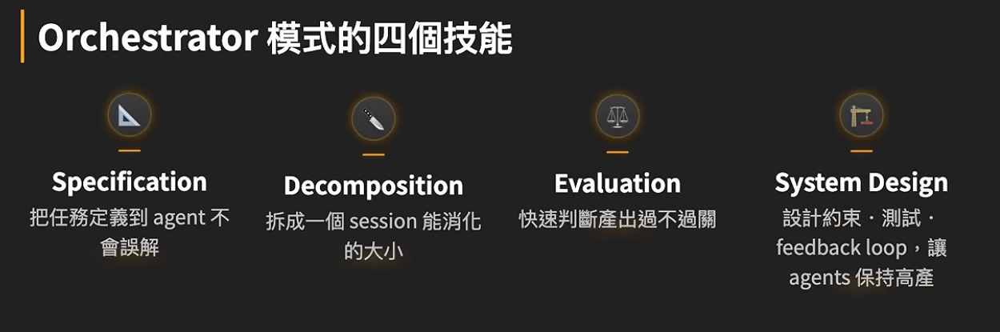

 
 

## SECTION 4. token 经济学

vibe 成本前期低后期暴涨。

agentic engineering 成本前期很高后期低，边际效应很高。

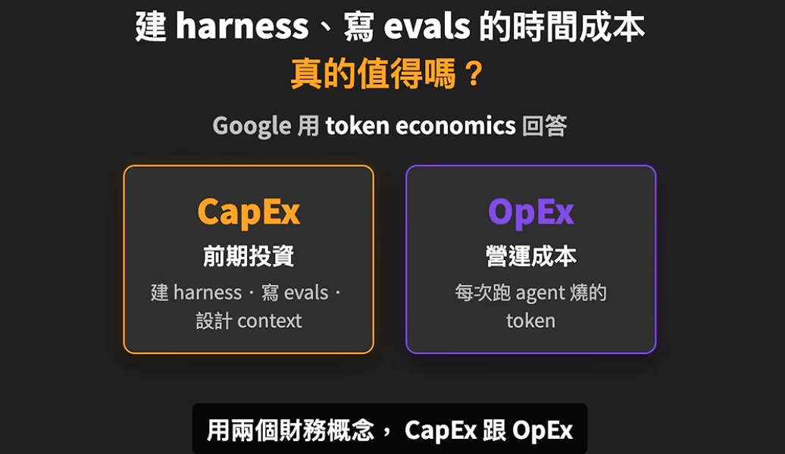
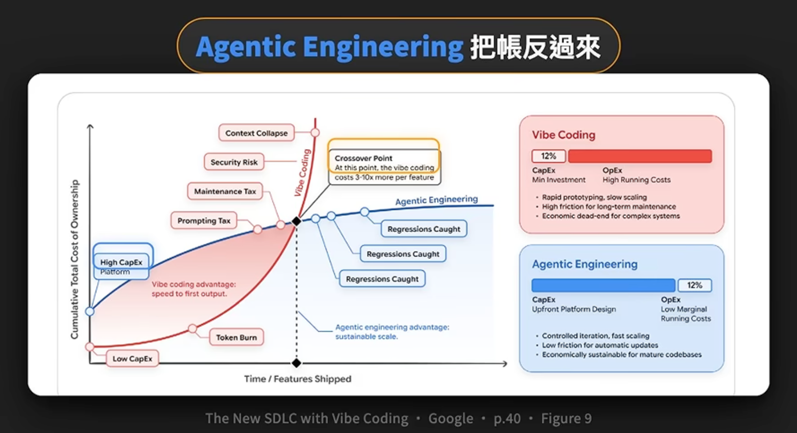

 
 

##  SECTION 5. 行动起来 - 今天你可以做的

### 如果你是开发者：
1. 建立和维护你的规则文档：比如CLAUDE.MD，技术栈、硬规则、workflow。10行就可以开始。agent每做一次你不想看到的事，就加一条规则。

2. test&eval套件在你code之前就写：一份好的测试套件，比任何自然语言的prompt都能更精确的传达你的意图

3. 要上线的code每一行都要review：对看起来很聪明的东西保持怀疑，对你不懂的东西一定要问：是什么？有什么作用？有什么风险？

4. 基本功不能忘记：debug的方法、系统设计的原则都要留着。ai放大你的这些专业，而不是替代它（vibe coder半路转行，这是要补的功课）

---
### 如果你是带团队的主管：
1. 把ai开放当成工程投资，不是生产力功能：配套 evals，只会产出有速度没品质的code，技术债越堆越高。
2. harness是团队共用资产：system prompt、skill库、eval套件需要共享+监控+review+定期维护
3. 人机混合会变成常态，团队需要的人才转型：能写最多code的工程师不再最有价值，能把agent指挥调度得好的才是。

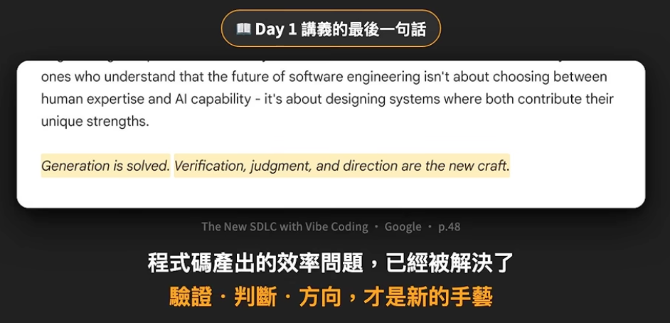
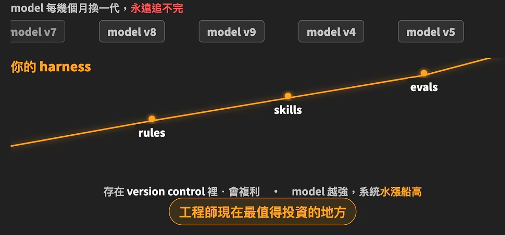