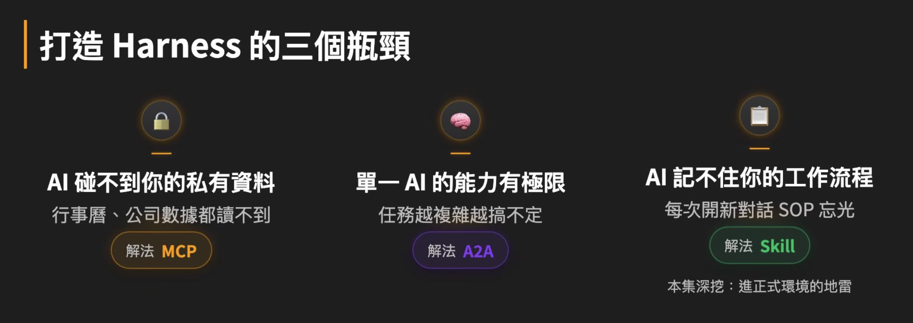
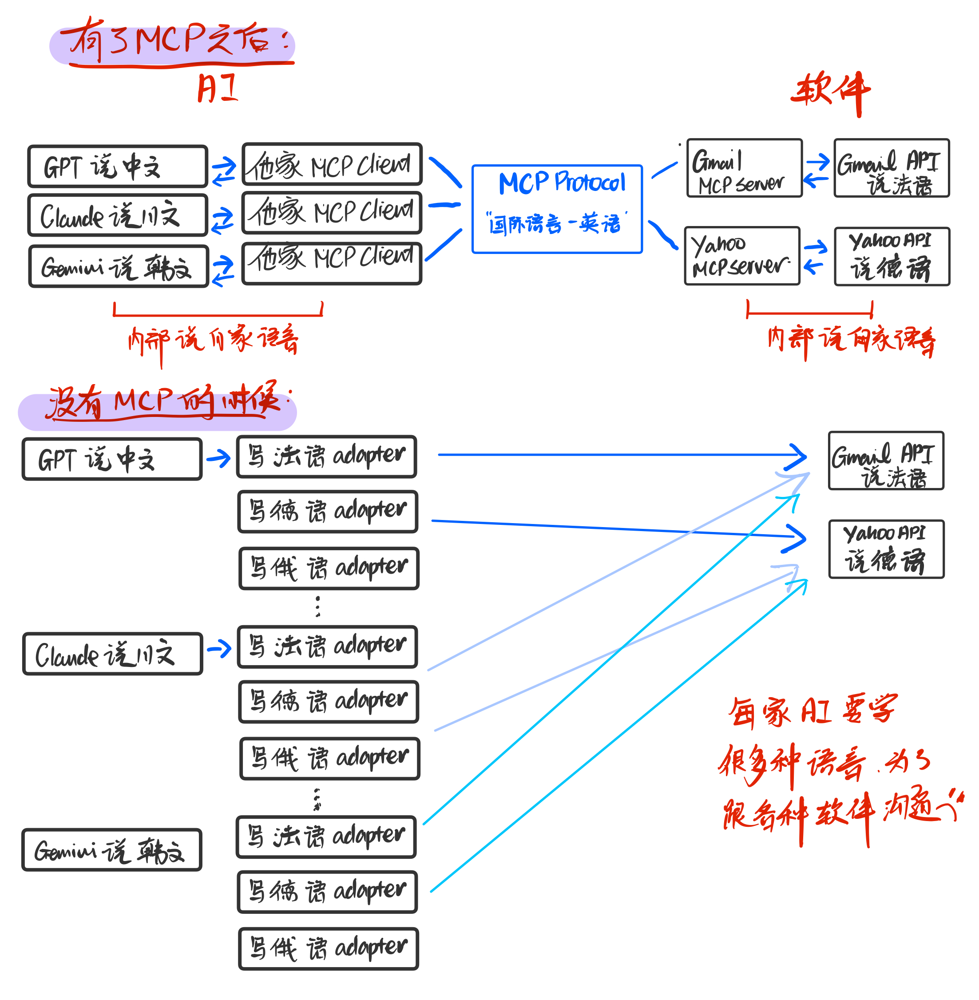
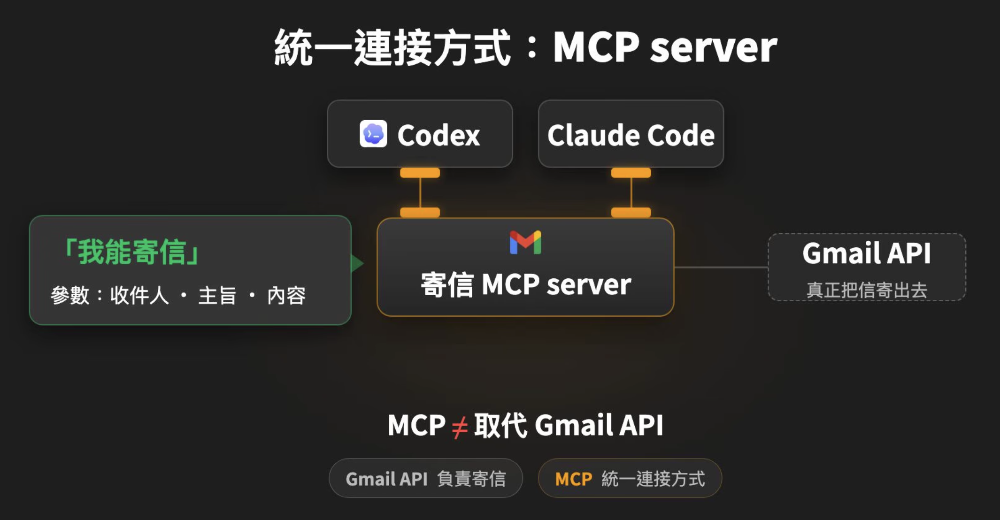
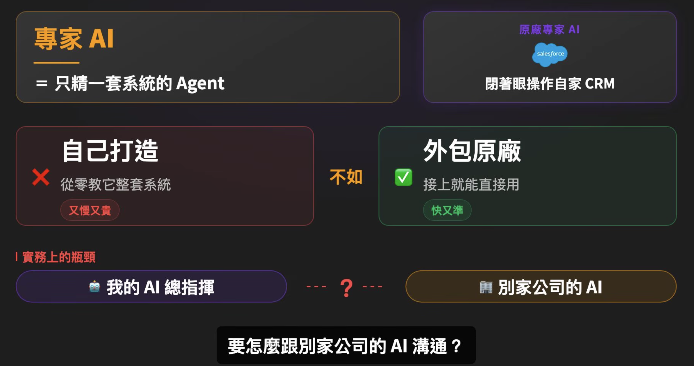
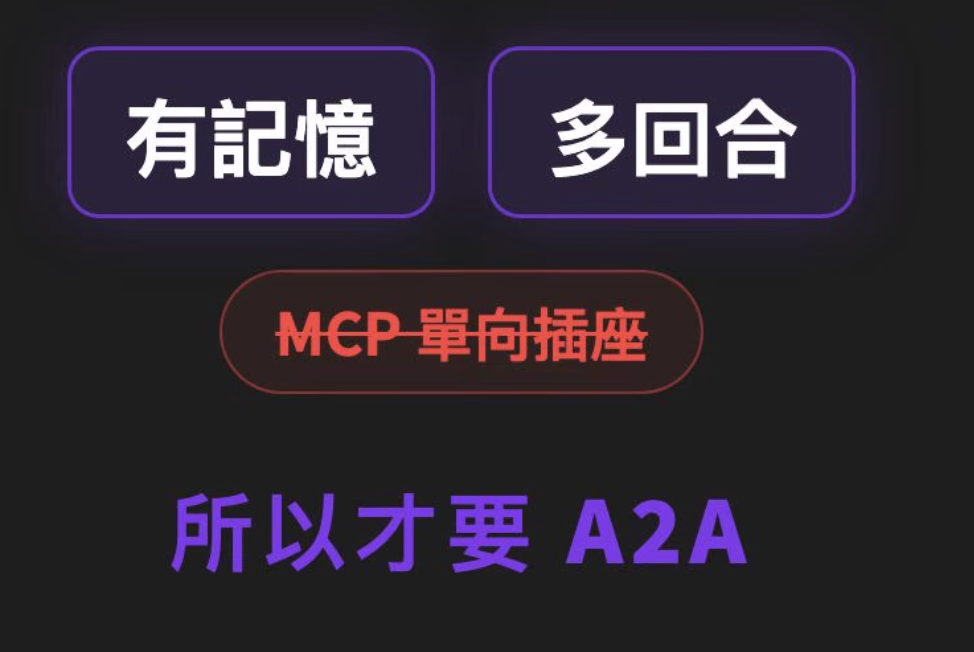
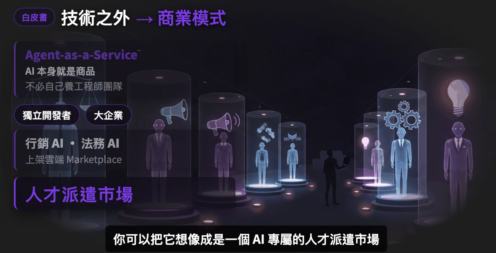
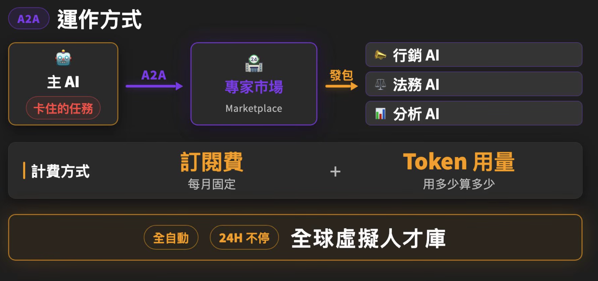
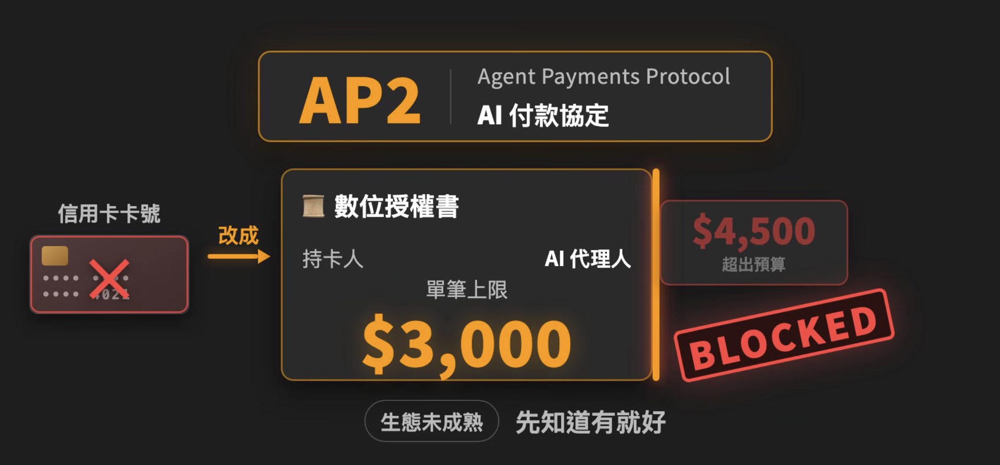

+++
date = '2026-08-18T09:57:44-04:00'
draft = false
title = '2026-08-03 「Google Vibe Coding 5-Day」 DAY2 '

categories = ['ai']
+++

 

## DAY2 Keywords：MCP、A2A、AP2、context rot、multi-agent

---

## SECTION 1. harness 三大瓶颈 + 如何解决？

见标题图。

---

## SECTION 2. MCP: 和API的区别？不能直接用API吗？

- API = Application Programming Interface 应用程序编程接口，aka应用接口。
- MCP = Model Context Protocol 模型上下文协议.

- API = 软件提供能力（What can this software do?）
- MCP = AI 调用这些能力的统一语言（How do AI systems ask for those abilities?）

品一品这两个不同层级的概念：API 定义"软件能做什么"，MCP 定义"AI如何和软件交流"。

我们打个比方：

AI = 软件公司的客户。MCP client端 server端 = ai公司和软件公司对外接洽的翻译官。API = 软件公司内部的员工。

每家 AI 和每个软件都有自己的"内部协议"或"调用规则"： 我们比喻为GPT说中文、Claude说日文、Gemini说韩文、gmail说法文、yahoo说德文。

MCP是一个协议，我们把它比喻为：国际语言是英文.

在没有MCP之前：你叫AI帮你用你的gmail寄一封信，每个AI都需要自己实现一套调用 Gmail API 的逻辑（每家都要自己写一个gmail adapter）

就像：GPT、Claude、Gemini都要自己学会说法语才能告诉gmail api要干什么。如果你突然想换成用yahoo邮箱寄这封信，这些AI又要去学yahoo api说的德语。

有了MCP协议之后：大家都说英语。

各家 AI 不需要再自己学很多语言，只需要自己有一个「会说英语的对外专员」术语叫通用客户端 MCP Client，就可以去和 Gmail、Yahoo 或其他各种软件「会说英语的接洽前台」术语叫 MCP Server 沟通，就可以让这些软件完成发邮件、查资料、读文件等各种事情了。

如果只有API：你发命令给GPT让它寄信 - GPT调用 gmail API 发参数给它 - API发信。

这一套流程都基于GPT已经知道：
    1. gmail api长什么样
    2. endpoint是什么
    3. 参数是什么
    4. OAuth怎么认证
    5. 出错什么办

换一个AI，它们可能对工具的呼叫方式和GPT不一样，所以每个AI都需要自己实现一套调用 Gmail API 的逻辑（aka. 每家都要自己写一个gmail adapter）。

MCP协议统一了这些 tool calling 的方式，AI 要调用一个软件的api就不用再自己专门写一套接入这家软件api的逻辑。

---

## SECTION 3. A2A是什么？和MCP的区别是？

A2A = agent-to-agent 用于多个agent之间双向沟通的协议。

**MCP 是 Agent 与 Tool 的共同语言。A2A 是 Agent 与 Agent 的共同语言。**

**MCP 是一个 agent 指挥一个工具完成具体任务，A2A是多个agent分工协作完成（比较复杂的）任务。**

MCP 是「没有记忆」的联系方式，因为对面是个API，不会记住用户喜好。A2A是「有记忆」的联系方式，因为对面是个 agent，可能会具备「记住用户喜好」的功能。

再拿上面的例子举例： 

我们有几个personal agents：GPT说中文、Claude说日文、Gemini说韩文。

这时候，有人（可能是yahoo原厂，也可能是第三方）开发了一个专门处理邮件的 Mail Agent，它擅长分类邮件、搜索邮件、撰写回复等工作，这个agent说阿拉伯语。

有 A2A 之前，每个 Agent 都说自己的语言。想让两个 Agent 合作，就得让其中一个学会对方的语言，或者另外写一个翻译。

有了 A2A 之后，大家都约定说同一种「A2A 语」。支持 A2A 的 Agent 可以作为 Client 主动请求其他 Agent，也可以作为 Server 接收其他 Agent 的请求。于是不同 Agent 就能像不同领域的专家一样协同完成一个复杂任务。

---

### 【 Multi-Agent = 多个 Agent 协作：我们为什么需要？】

- Personal Agent（个人 Agent）：就像 GPT、Claude，是你长期磨合、训练成符合自己习惯的私人助理。

- Professional Agent（专家 Agent）：专门负责某一个领域或任务的 Agent，例如邮件、日历、法律、旅行等。这些通常由别人开发好，我们直接调用即可，不需要自己重新训练。

Multi-Agent 的目的不是为了让更多同质的 AI 一起工作，而是为了把复杂任务拆分给不同的专家Agent，让每个 Agent 只关注自己最擅长的一小部分任务，从而减少 Context Rot，提高整体效率和准确性。

比如：

我希望 GPT 完成一套复杂的早晨 Workflow：订咖啡外卖、查看邮件、查看今天的日程、总结昨天的会议纪要。

如果这些工作全部都让 GPT 一个 Agent 完成，它需要同时处理：
我的饮食偏好、咖啡优惠、邮件内容、日历安排、会议记录、我的工作习惯、今天的目标、等等。

随着需要处理的 Context 越来越多，它虽然不一定会超过 Context Window，但可能越来越难抓住真正重要的信息，推理质量开始下降。这就是 Context Rot（上下文腐烂）。

因此，Multi-Agent 的做法是：

Personal Agent（GPT）

│

├── Coffee Agent（找优惠、下单）

├── Mail Agent（整理邮件）

├── Calendar Agent（整理日程）

└── Meeting Agent（总结会议）

Personal Agent 负责理解我的需求、协调任务和整合结果。各个 Professional Agent 只负责自己最擅长的事情。最后再把结果交回给我的 Personal Agent，由它统一汇总给我。

---

## SECTION 4. AP2是什么？

AP2 = Agent Payments Protocol

用于 Agent 与支付系统之间的开放协议，让 AI Agent 可以「安全、可验证」的代表用户完成付款。

比如：你告诉你的 Personal Agent「如果你看到网上全新 iPad mini 降到 $399 以下，就帮我买。」

Agent可以做的：
- 每天去苹果官网上查看价格（MCP）
- 找其他 Shopping Agent 合作实时监控各种购物网站（A2A）

真正付款的时候就需要 AP2。
AP2 要解决的问题不是「agent怎么付钱？」而是「Agent 凭什么可以花你的钱？」

例如：
    - 我真的授权它了吗？
    - 它最多能花多少钱？
    - 超过预算怎么办？
    - 商家怎么知道这真的是我的意思？
    - 如果买错了，责任算谁的？
这些都是 AP2 要解决的问题。

